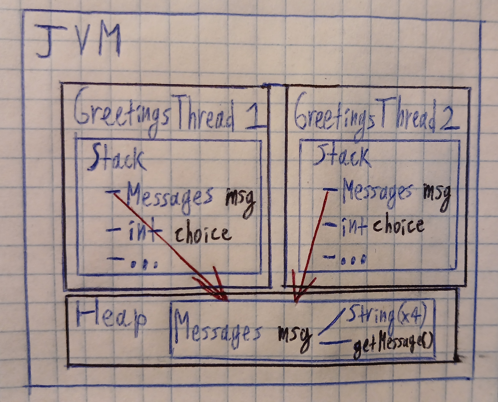

# Q1

The output is different each time because the threads (two instances of `GreetingsThread`) run in parallel. Due to race conditions, the order of printing the information on screen is unpredictable. Notably, several strings of "`Good morning!`" and "`Good afternoon!`" are printed in sequence. since the `for` loop in every thread is executing very fast.

Memory diagram at `MARK`:


# Q2

The output alternates between "`Good morning!`" and "`Good afternoon!`" (because of the 1 second delay after each output, the other thread can process and output a string before the first thread's `for` loop finishes). Usually the "afternoon" thread finishes last, but that is not always the case (again, due to race conditions).

# Q3

The output is the same as in [the previous case](#q2), but "`Main method exiting`" is printed first. That's because a Java program finishes not only when `main()` is finished, but also when all children non-daemon threads finish.

# Q4

After we call `morningThread.join(5000)`, the main thread waits up to 5 seconds (or until the morning thread finishes) before starting the afternoon thread. Because `join(5000)` blocks the main thread for up to five seconds, the morning thread gets a head start, printing roughly five messages, before the afternoon thread even begins.

# Q5

`join()` blocks indefinitely until the thread finishes, while `join(10)` waits up to 10 milliseconds for the thread to complete before proceeding (whether the thread is done or not).

# Q6

There are exactly two possible outputs:
```
25
49
```
and
```
49
25
```

# Q7

The output is **non-deterministic**: both threads print `" M i s s i s s i p p i "` (each character on a new line with a space), but their executions interleave randomly, so the order of printing is random: each thread’s characters stay in order, but lines from the two threads mix unpredictably.

# Q8

A race condition is possible because `tail.next = new Node(s, null);` and `tail = tail.next;` are not atomic and lack synchronization, so if two threads execute them concurrently, they can interleave in a way that corrupts the list. 

For example, one thread might update `tail.next`, but before it updates `tail`, another thread does the same using the original `tail`, causing both to overwrite each other's changes. As a result, nodes can be lost or mislinked, breaking the structure of the linked list.

# Q9

To solve this race condition, we need to make the two operations (`tail.next` update and `tail` movement) atomic using synchronization - either via **locks** (`synchronized`) or lock-free techniques (CAS).

# Q10

The `synchronized` keyword is necessary because `value++` is not an atomic operation. It involves three steps (read, increment, write) that can interleave across threads, causing lost updates. Without synchronization, two threads could read the same `value`, increment it separately, and write back stale results, leading to incorrect counts. `synchronized` ensures the entire operation executes atomically, preventing race conditions.
